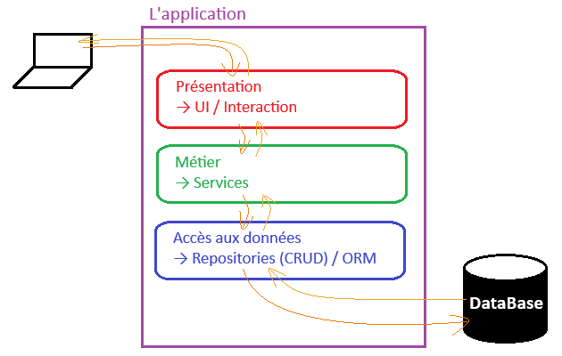
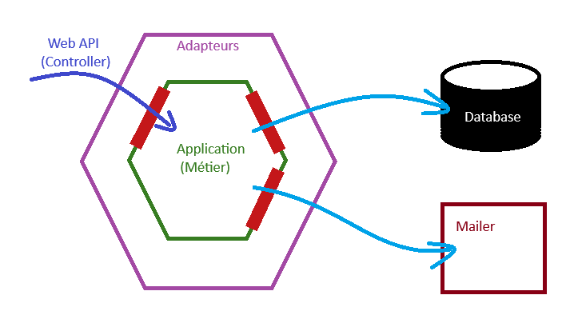
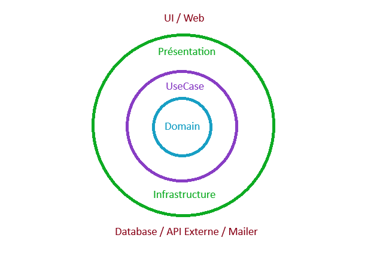
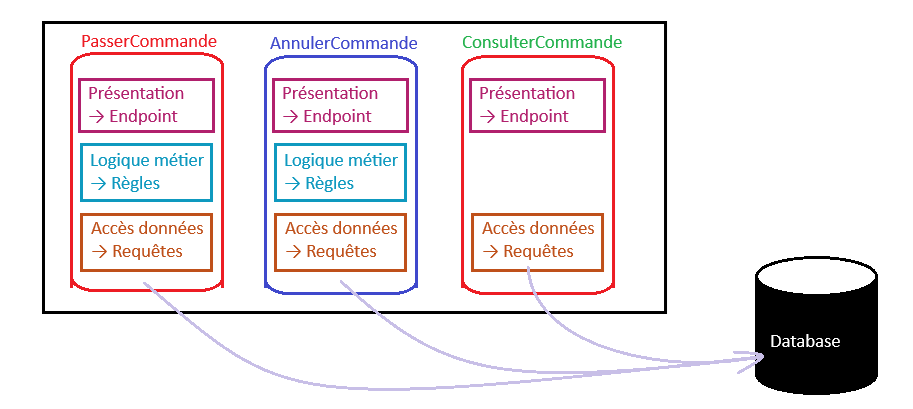

# Architectures internes
L'organisation du code et des dépendances

## Architecture en couches (N-Tier / Layered)
Découpe horizontale en fonction des responsabilités techniques.

La découpe la plus fréquente est la « 3 tiers » 
- Présentation : Affichage + Interaction
- Métier : Appliquer les règles business
- Accès aux données : Lecture et écriture (Db, Fichier, Service ext, ...)  

### Forces
- Simple
- Parfait pour des applications (CRUD)

### Limites
- Couplage fort de chaque couche
    - Changer un élément peut impacter les autres 
    - Mapping entre les modèles de chaque couche
-  Difficile à faire évoluer à long terme

## Architecture Hexagonale
L'objectif est d'isoler les règles métier et de définir des ports (interfaces) de communication vers l'extérieur.
Adaptateur (extérieur) qui implémente les ports.  

### Forces
- Règles métier testables facilement (Indépendantes).
- Technologies remplaçables sans affecter le métier. 

### Limites
- Mise en place complexe (Plus d'interface et mapping)
- Excessif pour des petites applications

## Clean Architecture
Basée sur l'idée de l'architecture Hexagonale et l'architecture oignon. Organisation du code sous forme de cercles concentriques.  

**Règle d'or :** _Les dépendances du code ne pointent que vers l'intérieur, un élément intérieur ne connaît jamais la couche supérieure._

### Forces
- Structure organisée avec les règles de dépendances
  - Visualisation "simple" du projet
  - Évolution du projet facilitée
- Le métier est très protégé (Chaque use case isolé)
- Règles métier facilement testables

### Limites
- Beaucoup de code de structure
- Risque de sur-ingénierie sur les projets simples

## Vertical Slice
Contrairement à la N-Tier qui découpe en couches basées sur les rôles techniques.  
Cette architecture découpe le projet verticalement sur base des fonctionnalités.  

### Forces
- Les fonctionnalités sont peu couplées entre elles.
- Chaque fonctionnalité est isolée 
  - Elle peut être adaptée au besoin (implémentation différente possible).
  - Facilité pour : Ajout, modification et débug une tranche.

### Limites
- Risque de répéter les règles métier (Nécessite une refactorisation).
- Une modification métier ou data peut avoir des impacts dans plusieurs tranches.